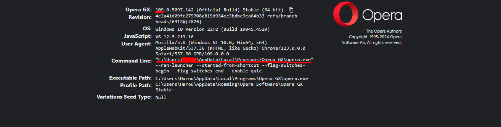

# Selenium & Python : Opera Browser

***Remark***

First script **test.py** is for Opera browser setup (since Opera is not supported anymore)

## Setup Opera for Selenium :

**Requirements**

* Opera browser installed on your machine
* Opera WebDriver : you can install it through this [link](https://github.com/operasoftware/operachromiumdriver/releases) based on the version of your browser .

To check the version and the location of your browser, you can type in the search bar "opera://version" .
You will use both the browser and the web-driver paths in your scripts .

